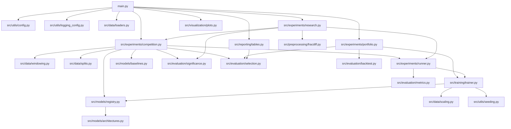
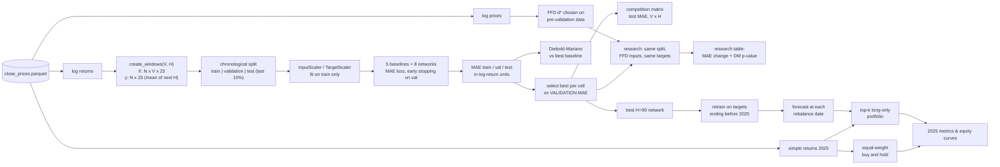
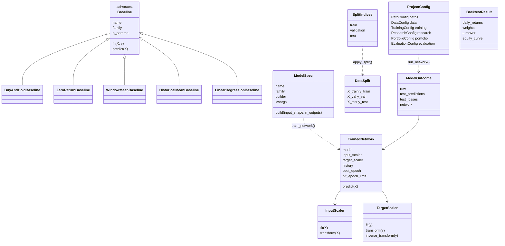

# Architecture

## 1. Project overview

The project forecasts the **mean daily log return of 23 S&P 500 stocks over
the next H days** (H = 1, 5, 30, 90) from the previous V days (V = 5, 10, 30,
90), minimising MAE. For each of the 16 window combinations it trains 8 neural
networks from 4 families (dense, recurrent, convolutional, mixed) and 5
baselines, selects the best model per cell on validation, and reports its
test MAE. It also runs a one-change-at-a-time pre-processing study and a
2025 back-test of a portfolio driven by the best 90-day model.

## 2. Module dependency diagram



| Package | Responsibility |
|---|---|
| `src/utils` | Frozen configuration dataclasses, logging set-up, seeding |
| `src/data` | Price snapshot I/O, log returns, sliding windows, chronological splits, scalers |
| `src/preprocessing` | Fixed-width fractional differentiation and ADF-based choice of `d` |
| `src/models` | Baselines, Keras architectures, named model catalogue |
| `src/training` | Compile, fit with early stopping, loss history, convergence flag |
| `src/evaluation` | MAE metrics, Diebold-Mariano test, validation-based selection, back-tester |
| `src/experiments` | The three stages: competition, research, portfolio |
| `src/reporting`, `src/visualization` | CSV / Markdown / text tables and PNG figures |

## 3. Data flow



### Split geometry of one cell

```
windows:  0 ........................................................ N-1
          |------------- train -------------|--val--|---- test ----|
                                            ^       ^
                         (embargo of V+H-1  |       ceil(0.1 N) windows,
                          windows here in   |       identical to the
                          the research      |       professor's
                          variant)          |       train_test_split(
                                            |       shuffle=False)
```

## 4. Class diagram



## 5. Key design decisions

| Decision | Reason |
|---|---|
| Test set = last `ceil(10%)` windows, chronological | Reproduces the professor's `train_test_split(test_size=0.1, shuffle=False)` exactly (unit-tested) |
| Selection on validation, report test | Correction lecture: choosing on test is cheating |
| Target centred per asset, scaled by **one** scalar | MAE on scaled targets equals MAE in log-return units divided by a constant, so the objective is unchanged; per-asset scales would re-weight assets |
| MAE always in log-return units, including research | Errors for different pre-processing must be comparable (lecture critique of transformed targets) |
| No ReduceLROnPlateau by default | Lecture: first find a learning rate that gives a clean curve |
| Patience 25, best weights restored, `hit_epoch_limit` flag | Lecture criticised curves stopped while still descending |
| Diebold-Mariano with Newey-West lag `H-1` | Overlapping targets make loss differences autocorrelated |
| Research changes one thing at a time | Lecture: otherwise no conclusion can be drawn |
| Portfolio model retrained on targets ending before 2025 | No look-ahead, and uses the most recent pre-2025 data |

## 6. How to run

```bash
python -m venv .venv
.venv\Scripts\activate            # Windows  (source .venv/bin/activate elsewhere)
pip install -r requirements.txt
python main.py --quick            # ~5 minutes, smoke test into outputs_quick/
python main.py                    # full run into outputs/ (several hours on CPU)
pytest                            # 48 tests, ~1 minute
```
